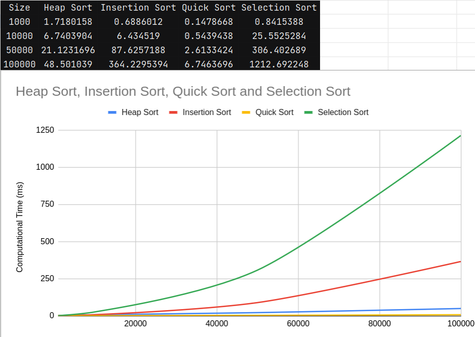

# Sorting Algorithm Performance Analysis

## Experiment Setup

### Algorithm Selection
The algorithms selected for this experiment were:
- Heap Sort
- Insertion Sort
- Quick Sort
- Selection Sort

These were implemented in Kotlin, and their performance was measured using `measureNanoTime` for precision.

### List Generation
The lists of integers were generated using Kotlin's `Random.nextInt` function. The range for the integers was set between `0` and the size of the list being generated. This approach was chosen to simulate the worst-case scenarios for sorting algorithms, where no assumptions about the distribution of input can be made.

### Experiment Runs
Each sorting algorithm was tested across different list sizes: `1,000`, `10,000`, `50,000`, and `100,000`. To obtain reliable data, each test was performed `5` times, and the average time was calculated and used for the final comparison.

## Results Analysis

### Overview
The results indicate a clear distinction between $O(n^2)$ and $O(n log n)$ complexity algorithms. As expected, Quick Sort and Heap Sort show much better performance on large datasets compared to Insertion Sort and Selection Sort.

### Detailed Observations
- **Heap Sort** performed consistently well, maintaining a growth close to $O(n log n)$. Its performance was not as good as Quick Sort for smaller list sizes but became competitive as list sizes increased.
- **Insertion Sort** showed good performance on smaller lists but its time complexity of $O(n^2)$ made it inefficient for larger lists.
- **Quick Sort** was the fastest among all the algorithms for almost all list sizes. Due to its divide-and-conquer approach, it handled large lists very efficiently.
- **Selection Sort** was the slowest, with its performance degrading significantly as the list size grew, which is consistent with its $O(n^2)$ time complexity.

### Conclusions
Based on the experiments conducted, **Quick Sort** is recommended for sorting large datasets due to its superior average-case performance. **Heap Sort** is a good alternative, particularly when the worst-case performance is a concern, as Quick Sort's performance can degrade to $O(n^2)$ in the worst case.

For smaller datasets or nearly sorted data, **Insertion Sort** may be a practical choice because of its low overhead and efficiency in handling nearly sorted lists.

**Selection Sort** does not perform well compared to the others and is not recommended for any case where performance is a concern.

# Frontiers in Sorting
## MinFinder Algorithim

The document is a research paper titled "MinFinder: A New Approach in Sorting Algorithm" presented at the 8th International Congress of Information and Communication Technology (ICICT 2019).
It introduces MinFinder, a novel sorting algorithm that aims to optimize stability, computational time complexity, and memory usage compared to traditional sorting algorithms. 
The algorithm is particularly noted for its in-place sorting capability, maintaining the relative order of equal elements (stability), and its simplicity in implementation using a single loop control structure.
The authors compare MinFinder's performance with other common sorting algorithms, highlighting its efficiency in terms of time and space complexity.
The paper concludes that MinFinder shows promising results in reducing computational time for sorting operations and suggests further research to explore its practical applications and potential improvements.
