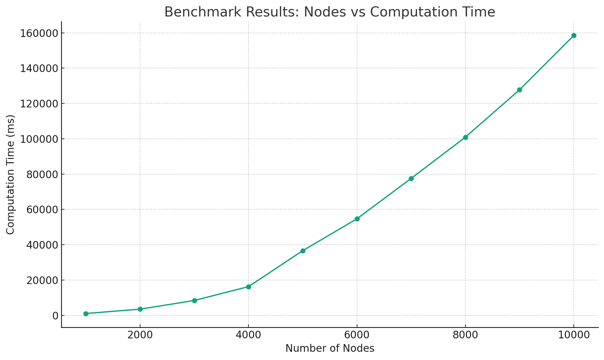
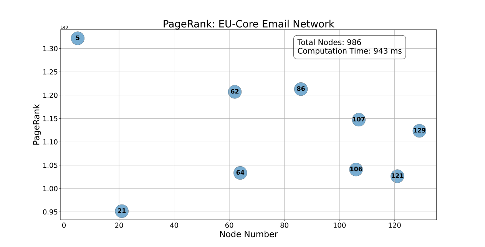
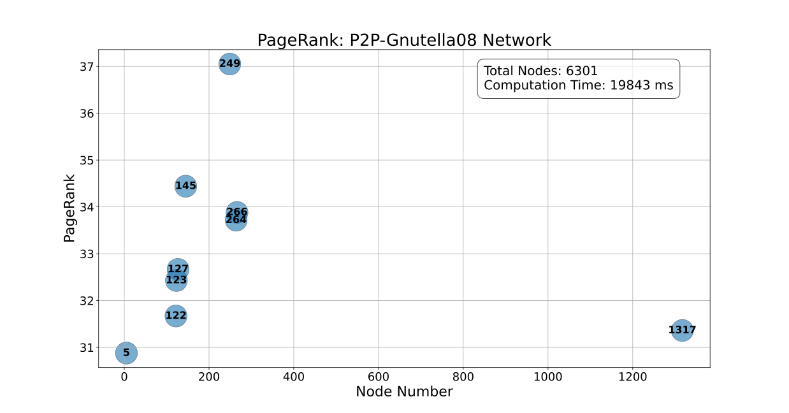
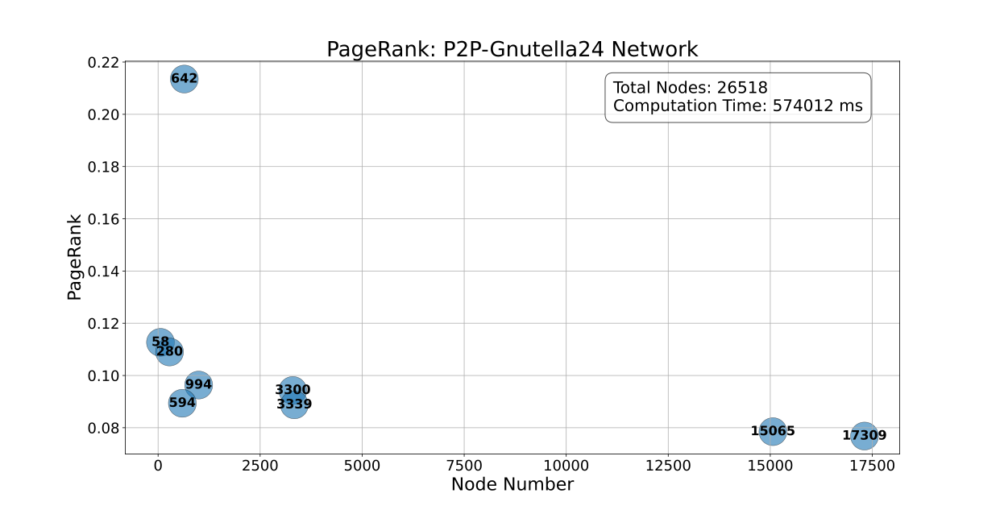

# PageRank Implementation in Kotlin

## Overview

This project contains a Kotlin implementation of the PageRank algorithm, used to calculate the importance of nodes in a graph. It includes functionality to generate random graphs, compute PageRank values, and benchmark the algorithm's performance on graphs of varying sizes.

## Features

- Generate random directed graphs with a specified number of nodes and edges.
- Compute PageRank values for the nodes in a graph.
- Benchmark the PageRank algorithm performance.
- Run the PageRank algorithm on real-world datasets
## Usage

1. **Generate a Random Graph:**
   Use `generateRandomGraph(numNodes: Int, numEdges: Int)` to create a graph with specified nodes and edges.

2. **Compute PageRank:**
   Instantiate `PageRank` with a graph object and call `compute()` to get the PageRank values.

3. **Benchmarking:**
   Run `benchmark(nodeSteps: Int, maxNodes: Int, edgesPerNode: Int, outputFilePath: String)` to evaluate the performance on graphs of increasing size.

4. **Export to GEXF:**
   Use `exportGraph(graph: PageGraph<Int>, filename: String)` to save the graph in GEXF format.

## Results

### Benchmark Results

Graphs of increasing number of nodes with randomly generated edges were made to benchmark the algorithm's scalability and performance.
The plot illustrates how the computation time increases with the number of nodes and how the top PageRank values vary with graph size.

### PageRank Results on Real-world Datasets

The datasets used in this project for computing PageRank are sourced from the Stanford Network Analysis Project (SNAP). These datasets represent various real-world networks, allowing for the practical application and evaluation of the PageRank algorithm.

Each plot represents a different dataset, illustrating the distribution of PageRank scores across nodes and highlighting the most influential nodes in the network.

1. **Email EU-core Network:**
   1. Graph Visulization: 
   2. Page Rank Results: 

2. **P2P Gnutella24 Network:**
    1. Graph Visulization: 
    2. Page Rank Results: 
3. **P2P Gnutella08 Network:**
    1. Graph Visulization: 
    2. Page Rank Results: 

# References

1. Page, L., Brin, S., Motwani, R., & Winograd, T. (1999). The PageRank Citation Ranking: Bringing Order to the Web. Stanford InfoLab. [http://ilpubs.stanford.edu:8090/422/](http://ilpubs.stanford.edu:8090/422/)
2. Leskovec, J., & Krevl, A. (2014). SNAP Datasets: Stanford Large Network Dataset Collection. Stanford Network Analysis Project (SNAP). https://snap.stanford.edu/data